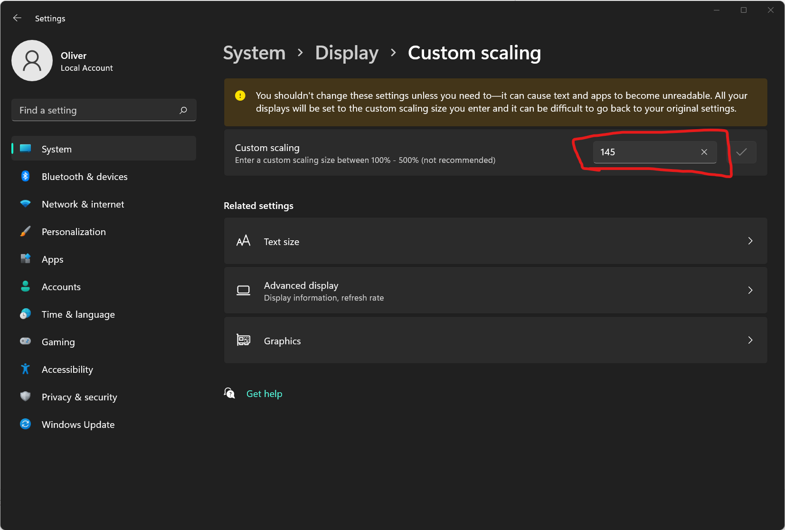

# Electron bug: moving window on custom Windows UI scaling

How to reproduce the issue:

-   Set custom UI scaling on Windows
    
-   Clone this repository
-   Install the dependencies: `npm install`
-   Start the electron app: `npm start`
